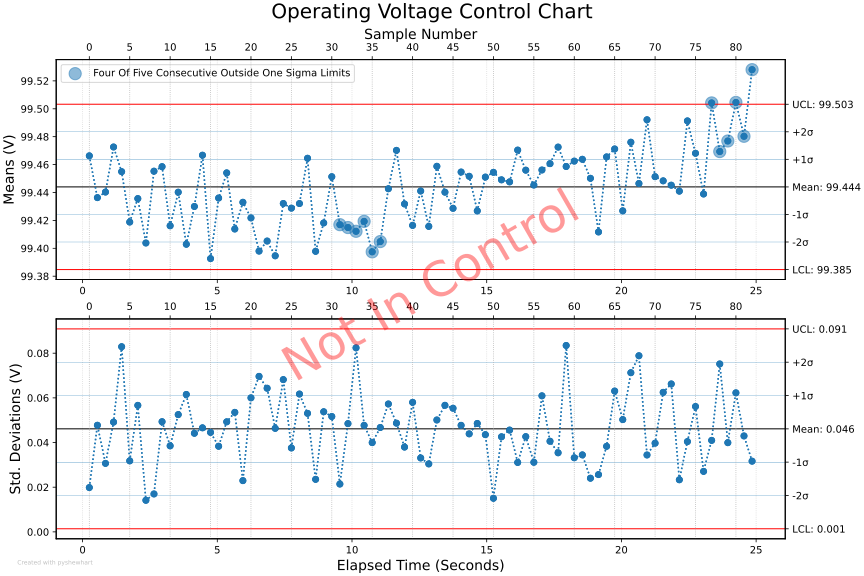
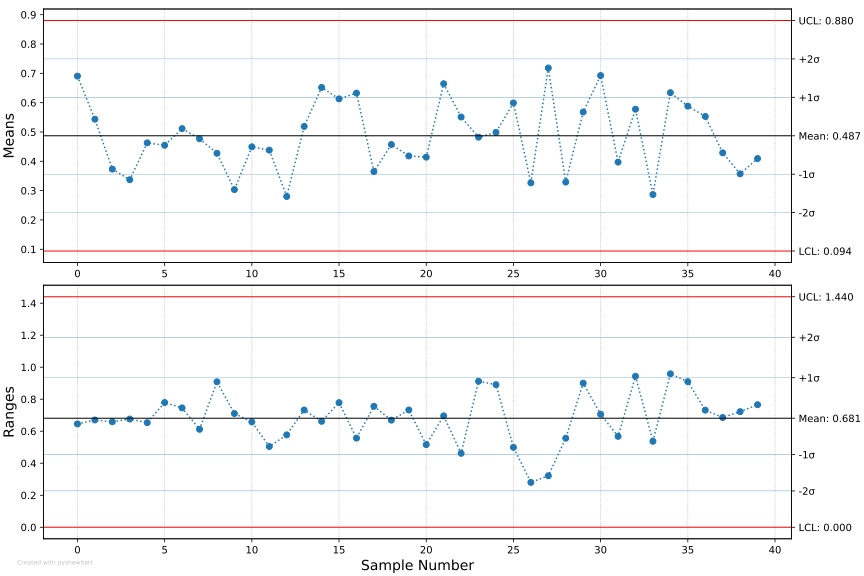
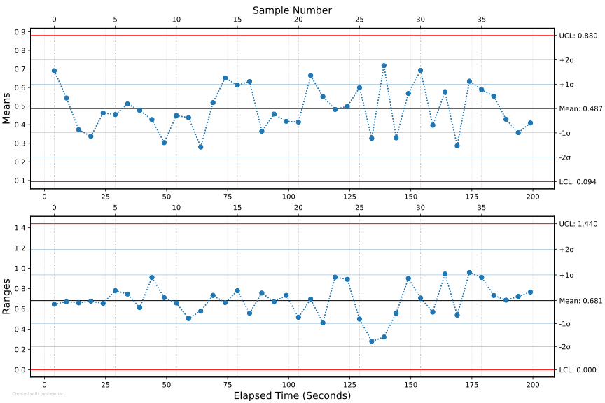
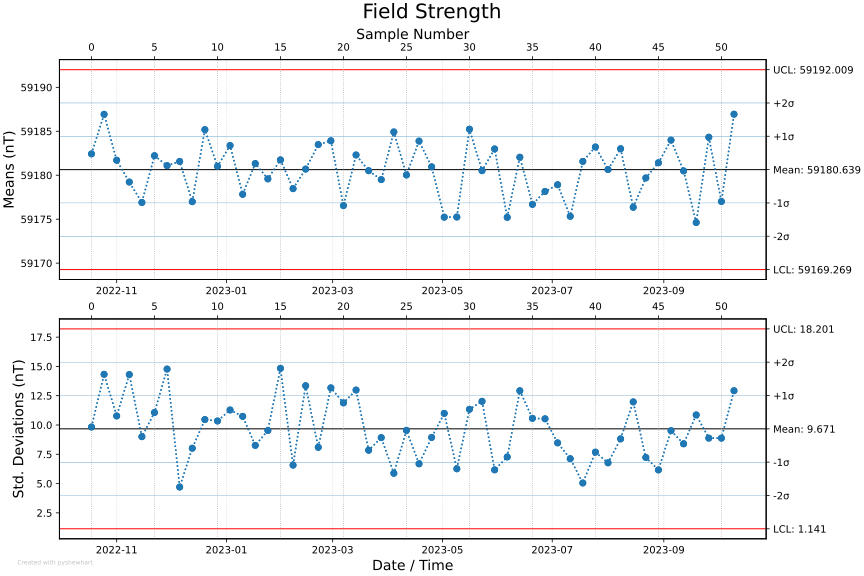
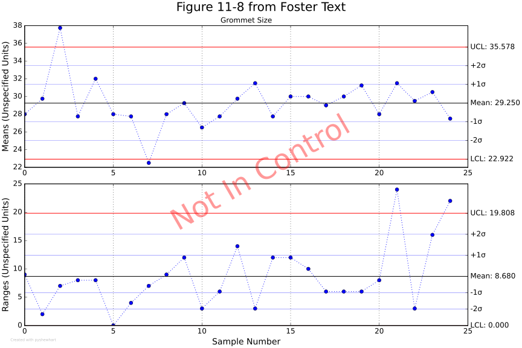
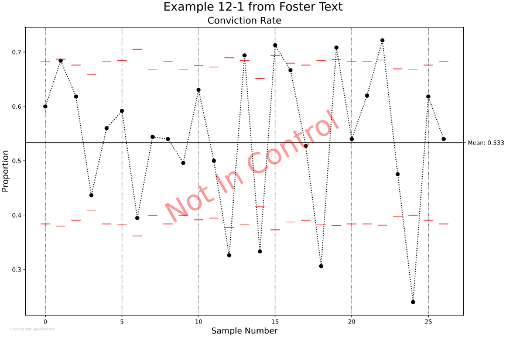
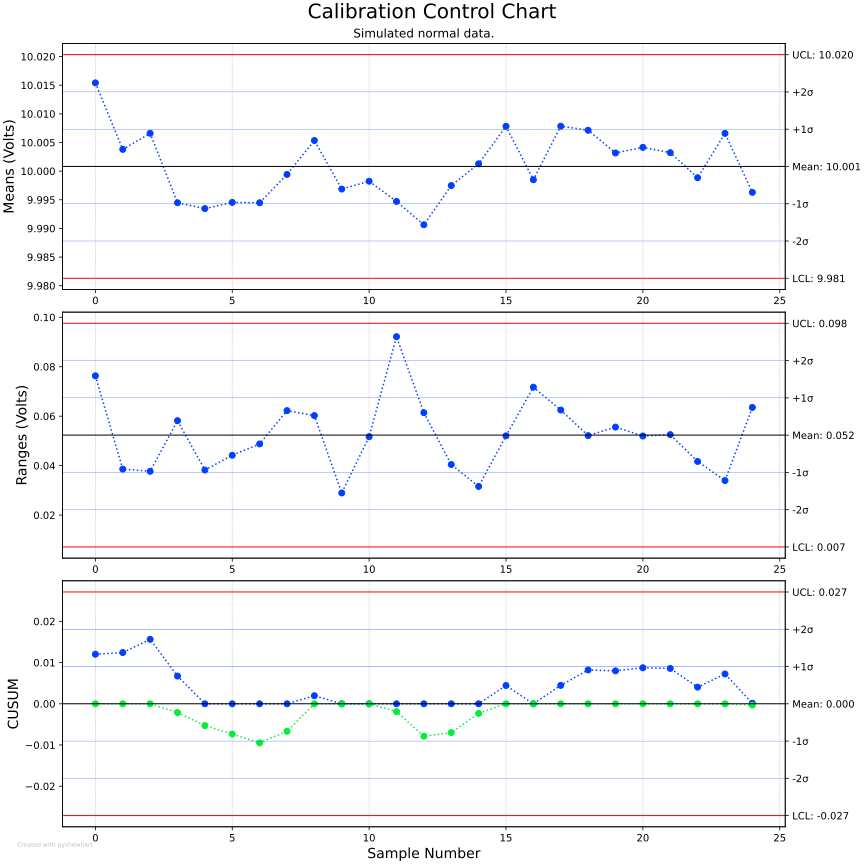
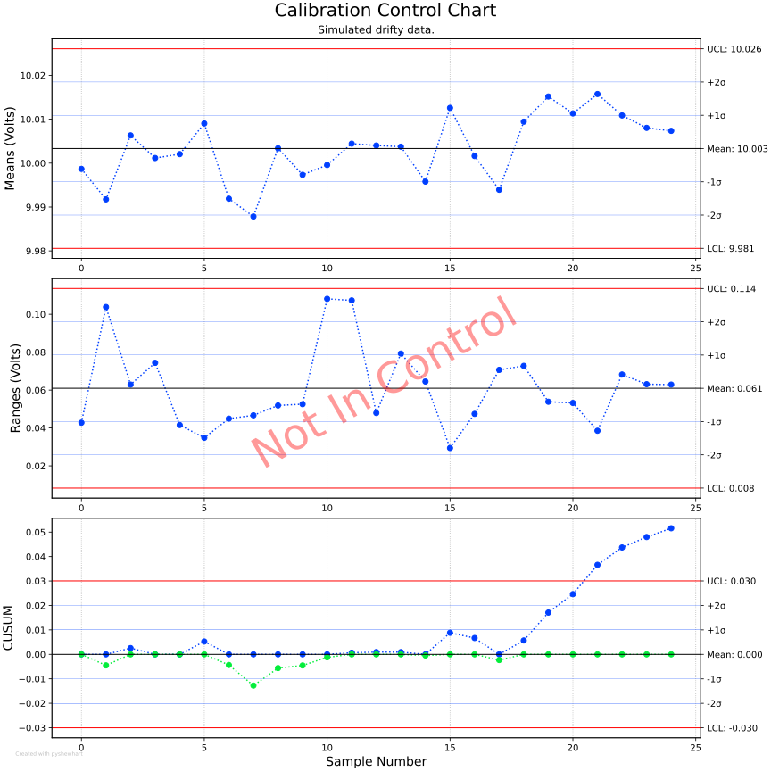

pyshewhart - Statistical Process Control Charts
================================================================================

[Statistical process control charts](https://en.wikipedia.org/wiki/Control_chart)
(also known as "Shewhart charts" after [Walter A. Shewhart](https://en.wikipedia.org/wiki/Walter_A._Shewhart)) are widely used in manufacturing and industry as a
quality-control tool.

The aim of this project is to provide an easy-to-use Python module for
generating the following types of control charts:

  - X̅ and R
  - X̅ and S
  - Cumulative Sum (CUSUM)
  - P-attribute

In addition to checking the data against the standard 3σ control limits,
it can also be evaluated against the well-known
"[Western Electric rule set](https://en.wikipedia.org/wiki/Western_Electric_rules)"
to detect additional statistical anomalies:



------------------------------------------------------------------------

### Usage

##### As a Python library:

An X̅ and R (mean and range) chart can be generated as simply as:

```
import random
import pyshewhart

measurements = [random.random() for _ in range(200)]
pyshewhart.XbarR(measurements)
```



------------------------------------------------------------------------

If you have time information, you can also provide that. Supported time types include:

 - `datetime`
 - `timedelta` 
 - various string formats (as supported by `dateutil.parser.parse`) 
 - Unix timestamps
 - elapsed seconds (`int` or `float`)

```
seconds = range(200)
pyshewhart.XbarR(seconds, measurements)
```

Notice that now the plot shows both sample numbers and elapsed seconds.



------------------------------------------------------------------------

##### Console Script:

Given a CSV file `field_strengths_nT.csv` containing timeseries and measurement data:

```
2022-10-12, 59194.401
2022-10-13, 59176.972
2022-10-14, 59179.485
2022-10-15, 59189.235
      ...
      ...
2023-10-08, 59196.725
2023-10-09, 59194.435
2023-10-10, 59187.456
2023-10-11, 59196.135
```

we can generate an X̅ and S (mean and standard deviation) plot with the following shell command:

```
$ pyshewhart field_strengths_nT.csv xbar-s 7 --units "nT" --title "Field Strength"
```



------------------------------------------------------------------------

### Examples

A few other examples can be found in the [examples/](pyshewhart/examples) directory. 

Several of these are recreated from a well-known textbook titled
*Managing Quality: Integrating the Supply Chain* by S. Thomas Foster,
including this X̅ and R chart:



Also a P-attribute chart:



The following shows the capabilities of a CUSUM chart to detect
small amounts of drift. 

First we see normal data:



And here we see the chart detecting a small amount of simulated drift:


